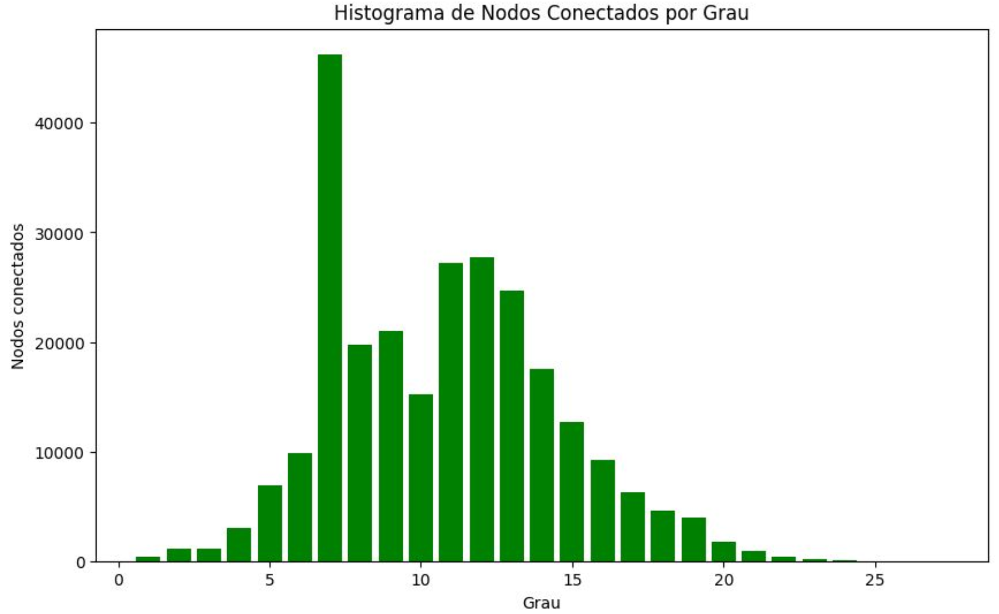
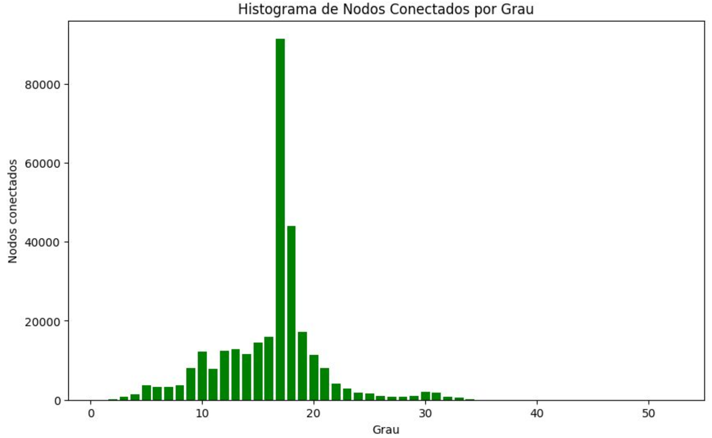
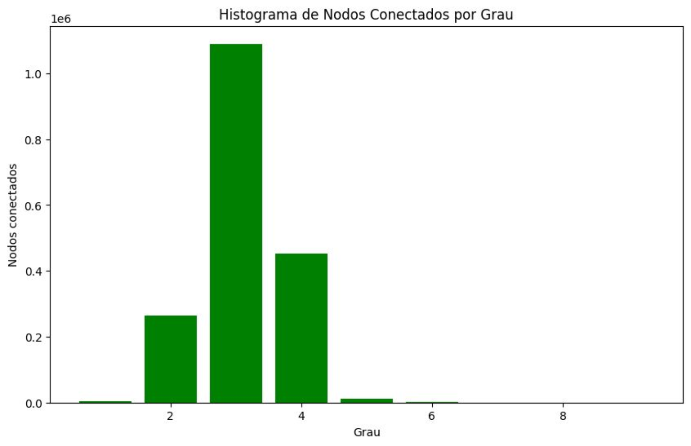
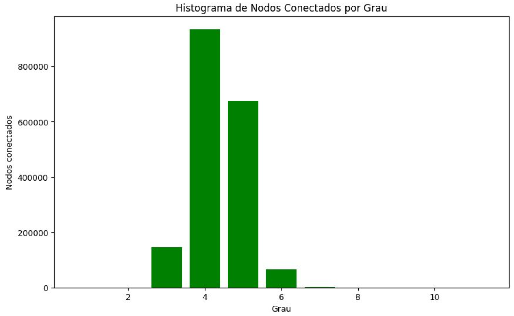

# 🔗 Getting to Philosophy

[](https://www.docker.com/)
[](https://www.python.org/)
[](https://jupyter.org/)
[](LICENSE)

A data-driven investigation of the **"Getting to Philosophy"** phenomenon on Wikipedia — the empirical observation that clicking the first link in almost any Wikipedia article repeatedly eventually leads to the **Philosophy** page.

This project builds a full analysis pipeline over real Wikipedia XML dumps, modelling the link graph of the entire encyclopedia to measure reachability, mean distance, and degree distribution at scale.

This was developed as an academic project at **UFABC (Universidade Federal do ABC)**.

---

## 🎯 Motivation

In 2011, Randall Munroe (xkcd) popularized a well-known Wikipedia quirk: starting from virtually any article and repeatedly clicking the first link in the article body will, in most cases, eventually reach the **Philosophy** article. The pattern persists across languages and editions of Wikipedia.

This project goes beyond anecdotal evidence and rigorously quantifies the phenomenon using the full Portuguese (`pt`) and English (`en`) Wikipedia dumps:

- What fraction of all pages eventually reach **Philosophy**?
- How many clicks does it take on average?
- How does the shape of the link-graph change when considering *only the first link* versus *all links*?
- Is the behavior consistent across languages?

---

## 🏗️ Architecture

```
Getting-to-Philosophy/
├── Dockerfile                      # Builds the Jupyter Data Science environment
├── compose.yaml                    # Docker Compose service definition
├── requirements.txt                # Python dependencies
├── notebooks/
│   ├── 1. Select Dump.ipynb        # Download & verify a Wikipedia XML dump
│   ├── 2. Process Dump.ipynb       # Parse the dump and extract page links
│   ├── 3. Clear Data.ipynb         # Filter to valid article pages and links
│   └── 4. Compute Data.ipynb       # BFS/graph traversal & statistical analysis
├── scripts/
│   ├── md2ipynb.py                 # Converts README.md into a welcome notebook
│   └── template.json               # Notebook template used by md2ipynb.py
├── multistream/                    # Raw Wikipedia multistream XML dumps (mounted volume)
├── output/                         # Parquet files produced by the pipeline
├── docs/                           # Result graphs for documentation
├── jupyter-config/                 # Persistent Jupyter configuration (mounted volume)
└── jupyter-data/                   # Persistent Jupyter data (mounted volume)
```

### Environment

All analysis runs inside a Docker container built on top of `jupyter/datascience-notebook:latest`. Python dependencies (`requests`, `tqdm`, `pandas`, `pyarrow`, `pyre2`) are installed on top of the base image. Volumes are mounted so that the raw dumps, outputs, and notebooks persist outside the container lifecycle.

---

## 🔬 Pipeline

The analysis is organized as a four-stage Jupyter notebook pipeline. Each notebook writes its output to Parquet files, which are consumed by the next stage.

| # | Notebook | Input | Output | Description |
|---|----------|-------|--------|-------------|
| 1 | **Select Dump** | — | `.bz2` dump file | Downloads a Wikipedia dump, verifies integrity via SHA1, and decompresses the multistream XML |
| 2 | **Process Dump** | `.bz2` dump | `processed.parquet` | Streams through the compressed XML, parsing each article's wikitext and extracting raw links with `pyre2` (RE2-based regex) |
| 3 | **Clear Data** | `processed.parquet` | `cleared.parquet` | Filters to `namespace == 0` (article space), resolves redirects, and removes malformed entries |
| 4 | **Compute Data** | `cleared.parquet` | Console / plots | Builds the directed link graph, runs BFS from the **Philosophy** node, and computes reachability metrics |

### Key Implementation Details

- **Streaming XML parsing**: The dump is read as a multistream BZ2 file, enabling memory-efficient page-by-page processing without loading the full dump into RAM.
- **RE2 regex via `pyre2`**: The wikitext link extraction uses Google's RE2 engine through the `pyre2` binding, providing linear-time guarantees for regex matching.
- **Columnar storage**: Intermediate results are stored as Apache Parquet files via `pyarrow`, making subsequent stages fast even on hundreds of millions of rows.
- **Two traversal modes**: The pipeline supports `first_reference=True` (click the first link only) and `first_reference=False` (explore all links), letting you compare the two graph structures.

---

## 📊 Results

### Portuguese Wikipedia (`pt`) — First Reference

Starting node: **"Filosofia"**

| Metric | Value |
|--------|-------|
| Total nodes reachable | 261,969 |
| Coverage (% of pt Wikipedia) | ~13.75% |
| Mean distance | **10.72 clicks** |
| Diameter | 26 clicks |

The degree distribution is roughly bell-shaped, peaked near degree 7, indicating that most Philosophy-reachable pages sit at a moderate number of clicks from the target.



---

### English Wikipedia (`en`) — First Reference

Starting node: **"Philosophy"**

The English Wikipedia is dramatically larger, and the degree distribution shifts right and widens, with a peak near degree 17–18. The longer tail reflects the richer, more densely cross-linked article space.



---

### English Wikipedia (`en`) — All References

When *all* links in each article are followed (not just the first), the reachable set explodes: the graph becomes nearly complete and most pages reach Philosophy in just 3–4 clicks. The distribution collapses sharply around degrees 3–4.



---

### Portuguese Wikipedia (`pt`) — All References

The same effect holds for Portuguese Wikipedia. With all references enabled the distribution concentrates between degrees 4–5, confirming that the phenomenon is a structural property of Wikipedia's link graph rather than an artifact of the "first link" heuristic.



---

## 🚀 Getting Started

### Prerequisites

- [Docker](https://docs.docker.com/engine/install/) ≥ 24
- [Docker Compose](https://docs.docker.com/compose/install/) (bundled with Docker Desktop)

### Installation

1. **Clone the repository**:

```bash
git clone https://github.com/caiosoduto/Getting-to-Philosophy.git
cd Getting-to-Philosophy
```

2. **Build and start the container**:

```bash
docker compose up -d
```

3. **Retrieve the Jupyter access token**:

```bash
docker exec -it getting-to-philosophy jupyter notebook list
```

4. **Open the Jupyter interface** at [http://localhost:8888](http://localhost:8888) and paste the token when prompted.

### Running the Pipeline

Navigate to the `notebooks/` directory inside Jupyter and execute the notebooks **in order**:

```
1. Select Dump.ipynb      ← choose language (pt / en) and download dump
2. Process Dump.ipynb     ← parse wikitext and extract links (~hours for enwiki)
3. Clear Data.ipynb       ← clean and resolve redirects
4. Compute Data.ipynb     ← run BFS and generate plots
```

> **Note**: Processing the full English Wikipedia dump can take several hours depending on your hardware. The Portuguese dump is significantly smaller and completes in under an hour on a modern machine.

### Stopping the Container

```bash
docker compose down
```

Data in the mounted volumes (`notebooks/`, `multistream/`, `output/`) is preserved between runs.

---

## 📦 Dependencies

| Package | Purpose |
|---------|---------|
| `requests` | Downloading Wikipedia dump files |
| `tqdm` | Progress bars for long-running operations |
| `pandas` | Tabular data manipulation |
| `pyarrow` | Parquet I/O for efficient columnar storage |
| `pyre2` | High-performance regex via Google's RE2 engine |

All dependencies are pinned in [`requirements.txt`](requirements.txt) and installed automatically during the Docker build.

---

## 📁 Output Files

After running the full pipeline, the `output/` directory contains:

| File | Description |
|------|-------------|
| `processed.parquet` | Raw page → links mapping extracted from the dump |
| `cleared.parquet` | Cleaned, redirect-resolved article link graph |

---

## 🤝 Contributing

Contributions are welcome! Feel free to open an issue or submit a pull request for bug fixes, performance improvements, or support for additional Wikipedia language editions.

---

## 📄 License

This project is licensed under the **MIT License** — see the [LICENSE](LICENSE) file for details.
